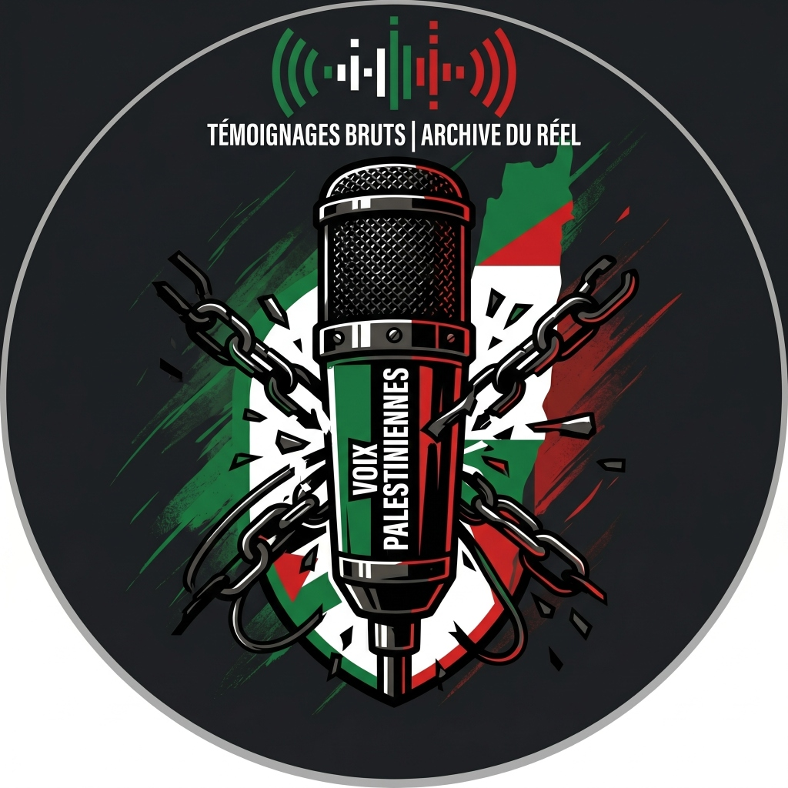
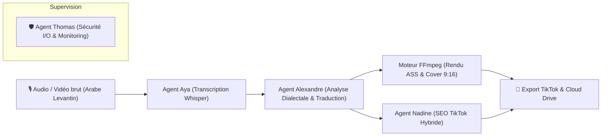

# 🇵🇸 Aya Studio — Plateforme IA de Traduction & Sous-titrage Solidaire

<p align="center">
  
</p>

<p align="center">
  <strong>La voix des témoignages palestiniens traduite pour TikTok en moins de 60 secondes.</strong><br>
  <em>Giving a voice to authentic Levantine & Palestinian testimonies for TikTok in under 60s.</em>
</p>

<p align="center">
  <!-- Badges Technologiques -->
  
  
  
  
  
  
  
  
  
</p>

---

## 🌍 Mission & Vision

### 🇫🇷 Français
À cause de la barrière de la langue et de la complexité du sous-titrage vidéo manuel, la quasi-totalité des témoignages enregistrés sur le terrain au Proche-Orient (dialecte gazaoui et levantin) peinent à franchir les algorithmes des plateformes sociales occidentales. 

**Aya Studio** est une plateforme technologique et solidaire conçue pour briser cette barrière. En combinant des modèles acoustiques dialectaux et des agents IA spécialisés, la plateforme transcrit, traduit avec rigueur sémantique et incruste des sous-titres animés au format vertical 9:16 (TikTok, Reels, Shorts) en moins de 60 secondes.

### 🇬🇧 English
Due to language barriers and tedious manual editing, authentic on-the-ground testimonies recorded in Palestinian and Levantine Arabic struggle to reach global audiences on social media.

**Aya Studio** is an open, solidarity-driven AI pipeline built to amplify these voices. By combining Levantine-tuned acoustic speech-to-text with specialized LLM agents, Aya Studio transcribes, translates idiomatically, and hardcodes dynamic bilingual captions onto 9:16 vertical videos in under 60 seconds.

---

## 🤖 Architecture Multi-Agents (The AI Team)

Le pipeline d'Aya Studio repose sur une synergie de 4 agents logiciels spécialisés :



1. **🎙️ Agent Aya (Transcription Acoustique & Horodatage)**
   - Moteur `Faster-Whisper` (Large-v3) optimisé avec horodatage précis au mot (`word_timestamps=True`).
   - Découpage temporel calibré pour la vitesse de lecture sur smartphone.

2. **🧠 Agent Alexandre (Expertise Dialectale & Contextualisation)**
   - Orchestration via Google Gemini 2.5 Flash.
   - Traduction fidèle des expressions idiomatiques gazaouies et régionales sans déformation du sens originel.

3. **🛡️ Agent Thomas (Architecte Back-End & Sécurité I/O)**
   - Vérification de l'intégrité des payloads, contrôle pre-flight (< 500 Mo) et monitoring du serveur.
   - Triage automatique et remontée des tickets d'incidents sur GitHub.

4. **📱 Agent Nadine (Stratégie Social Media & SEO Hybride)**
   - Génération de descriptions TikTok calibrées pour l'algorithme : Hook percutant, Contexte factuel de 2 lignes (style Impact), Call-to-Action incisif, narration SEO longue et 5 hashtags thématiques stricts.

---

## ✨ Fonctionnalités Majeures (Core Features)

* **⚡ Rendu Vidéo Haute Performance** : Pipeline `FFmpeg` générant du MP4 vertical 9:16 avec sous-titrage stylisé (police Impact, contour noir, surbrillance jaune/cyan karaoké et support natif de la calligraphie arabe).
* **🌐 Bilinguisme & RTL Intégral** : Interface 100% bilingue Français / Arabe avec adaptation visuelle bidirectionnelle (RTL natif).
* **💳 Modèle Économique Solidaire** :
  * Authentification sécurisée par session.
  * Recharges de crédits via Stripe Checkout (Packs 1, 5 et 25 crédits) et Webhooks vérifiés par signature cryptographique.
  * Bloc de soutien direct bénévole via PayPal.
* **📊 Tour de Contrôle Admin** : Dashboard privé protégé (`/admin`) monitorant les KPIs clés : inscrits totaux, chiffre d'affaires Stripe, taux de complétion des vidéos et charge système temps réel.
* **☁️ Synchronisation Cloud Automatique** : Worker Google Drive autonome transférant automatiquement chaque média traité vers un stockage distant sécurisé.
* **🛡️ Garde-fous Client Pre-Flight** : Détection immédiate côté navigateur des fichiers trop volumineux (> 500 Mo) ou non valides avant transmission réseau.

---

## 🛠️ Stack Technique

| Domaine | Technologies |
| :--- | :--- |
| **Serveur & API** | Node.js 20 LTS, Express 4.21, Express-Session |
| **Pipeline IA & Audio** | Python 3.12, Faster-Whisper Large-v3, Google Gemini API |
| **Traitement Média** | FFmpeg 6+, Libass, Polices Impact & Noto Sans Arabic |
| **Base de Données** | MongoDB Atlas, Mongoose 8 |
| **Paiements** | Stripe API v3 (Checkout Sessions & Webhooks cryptés) |
| **Frontend** | HTML5 / CSS3 moderne, Vanilla JavaScript, CSS Grid/Flexbox |
| **Infrastructure** | Hetzner Cloud CPX31, Ubuntu 24.04 LTS, Nginx, PM2, Certbot SSL |

---

## 🚀 Démarrage Rapide (Local Development)

### 1. Prérequis
* Node.js $\ge$ 20.x
* Python $\ge$ 3.10 avec `pip`
* FFmpeg installé et accessible dans votre `PATH`

### 2. Installation

```bash
# Cloner le dépôt
git clone https://github.com/artas971/plateforme-aya.git
cd plateforme-aya

# Installer les dépendances Node.js
npm install

# Installer les dépendances Python
pip install -r requirements.txt
```

### 3. Configuration des variables d'environnement
Créez un fichier `.env` à la racine à partir de `.env.example` :

```env
PORT=3000
NODE_ENV=development
SESSION_SECRET=votre_cle_de_session_securisee
ADMIN_EMAIL=artas971@gmail.com

# Base de Données MongoDB
MONGODB_URI=mongodb+srv://...

# Clés IA
GEMINI_API_KEY=AIzaSy...

# Stripe
STRIPE_SECRET_KEY=sk_test_...
STRIPE_WEBHOOK_SECRET=whsec_...
```

### 4. Lancement de l'application

```bash
npm start
```
Accédez ensuite à l'application sur [http://localhost:3000](http://localhost:3000).

---

## 📖 Déploiement en Production (Hetzner VPS)

Un guide pas-à-pas complet d'exécution du déploiement est documenté dans [`GUIDE_DEPLOIEMENT_VPS_HETZNER.md`](GUIDE_DEPLOIEMENT_VPS_HETZNER.md).  
Il couvre le provisionnement automatisé (`setup_vps.sh`), la sécurisation du pare-feu UFW, la configuration du reverse proxy Nginx, la génération du certificat HTTPS Let's Encrypt et la supervision PM2.

---

## 🤝 Éthique & Contribution

Aya Studio est un projet guidé par des principes d'indépendance, d'accessibilité et de solidarité humaine. Aucune exploitation commerciale agressive n'est tolérée ; l'intégralité des contributions financières sert à couvrir les frais d'infrastructure serveur et d'appels aux modèles d'intelligence artificielle.

---

<p align="center">
  <em>Développé avec détermination et solidarité pour faire entendre les voix authentiques.</em><br>
  <strong>Aya Studio © 2026</strong>
</p>
